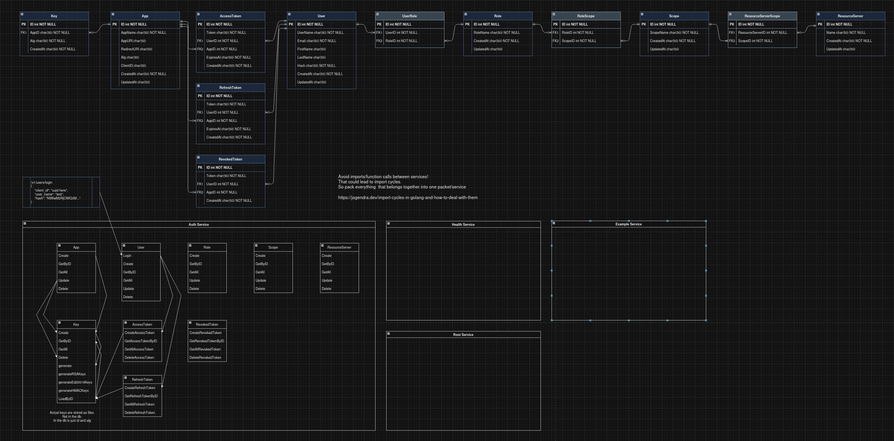
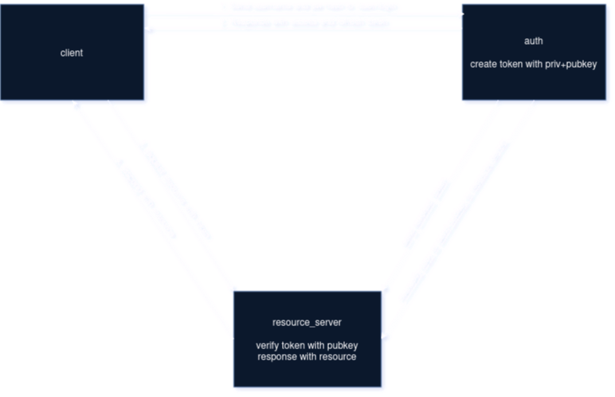

# auth

auth is a go api

It's a container with the api and a container with a postgresql database.

This project is in a not fully working pre-alpha state!

I want this to become a very basic auth provider.

Be aware this is NOT secure! I dont know what im doing.

I want to support different types of apps. Normal webapps with redirect url etc. and desktop apps like for example a game client with a different auth flow.

So far i added support for 3 different types of keys/algorithms (RS256,Ed25519,HS256).

## run compose in dev mode

> in dev mode the air package is used for hot reload

```bash
docker compose -f docker-compose.dev.yml up --build
```

## run with compose

```bash
docker compose up -d --build
```
show logs:
```bash
docker compose logs -f auth
docker compose logs -f postgres
```

## run with docker

```bash
docker build -t auth .
docker run -p 8080:8080 auth
```

## migrate db

```bash
# in config.yaml change database.host to localhost

# in docker-compose.yml add port mapping to postgres
# ports:
    #   - 5432:5432

# Build and start Database
docker compose up --build -d postgres

# Run migrate cli command
go run auth migrate
```

## some schemas



The image below is already outdated. Now i started implementing authorization code flow ;)

<!--  -->

#TODO: there are still some values set static for testing

#TODO: a guide how to actually use it with test-app etc + a proper insomnia export or something like that

#TODO: explain the login flow, different key algos etc
